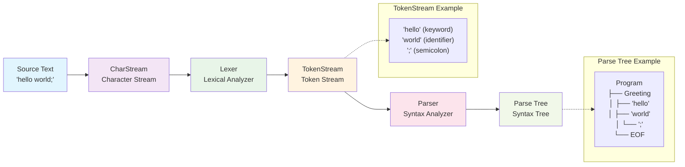

## Hello World Parser

::: note
Example reference code: https://github.com/hulo-lang/hulo-dev/tree/main/step-1-hello-world
:::

Let's create a simple Hello World parser to quickly experience ANTLR4.

### 1. Project Structure
```
step-1-hello-world/
├── antlr.jar
├── go.mod
├── go.sum
├── main.go
├── grammar/
│   ├── Hello.g4
│   └── .antlr/
│       ├── Hello.java
│       └── ...
└── generated/
    ├── Hello.interp
    └── ...
```

- **antlr.jar**: ANTLR4 toolchain
- **main.go**: Go program entry point, demonstrates how to use the generated parser to parse input text
- **go.mod**: Go module definition file, declares module name and dependencies
- **go.sum**: Go dependency verification file, ensures integrity of dependency packages
- **generated/**: Contains all code files generated by ANTLR for Go language
    - hello_lexer.go: Lexical analyzer, responsible for converting input text to lexical tokens
    - hello_parser.go: Syntax analyzer, responsible for building syntax trees
    - hello_listener.go: Listener interface, for traversing syntax trees
    - hello_base_listener.go: Base listener implementation
    - Hello.interp: ANTLR4 interpreter file
    - Hello.tokens: Token definition file
    - HelloLexer.interp: Lexical analyzer interpreter file
    - HelloLexer.tokens: Lexical analyzer token file
- **grammar/**: Stores grammar files, all `.g` or `.g4` grammar declarations are stored in this directory
- **grammar/.antlr/**: Contains Java code generated by ANTLR and compiled class files, used by ANTLR TestRig tool for grammar testing and visualization
    - `.java` files are source code generated by ANTLR
    - `.class` files are compiled bytecode
    - `.tokens` and `.interp` files are ANTLR internal files

After seeing this, beginners must be overwhelmed, haha. It's either this concept or that concept, but actually you only need to create three things — `go.mod`, `Hello.g4`, and `main.go`

First, let's initialize the project and create `go.mod` through command:
```bash
go mod init hulo-dev
```
This command means initializing a Go language project named `hulo-dev` in the current working directory.

### 2. Create Grammar File

After successfully initializing the project, we can enter the **grammar** directory and create a new `Hello.g4` file:

::: tip
In ANTLR4, both `.g` and `.g4` extensions are valid grammar file formats. Hulo project source code mainly uses `.g4`, but in documentation, `.g4` is often misidentified as "line 4 code block" and triggers highlighting. To avoid confusion, documentation examples uniformly use `.g` as the display extension.
:::

```antlr title="Hello.g"
grammar Hello;

// Grammar rule: program consists of greeting statements
program: greeting* EOF;

// Greeting statement: hello + name
greeting: 'hello' ID ';';

// Lexical rules
ID: [a-zA-Z_][a-zA-Z0-9_]*;  // Identifier
WS: [ \t\r\n]+ -> skip;      // Whitespace
```

This simple grammar defines how to parse "hello" statements:

1. **`grammar Hello;`** - Define grammar name, this name should match the filename. Just like Java class names correspond to filenames.
2. **`program: greeting* EOF;`** - Program consists of zero or more greeting statements, ending with end-of-file token
3. **`greeting: 'hello' ID ';';`** - Greeting statement consists of keyword "hello", identifier, and semicolon
4. **`ID: [a-zA-Z_][a-zA-Z0-9_]*;`** - Identifier starts with letter or underscore, followed by letters, numbers, or underscores
5. **`WS: [ \t\r\n]+ -> skip;`** - Whitespace characters (spaces, tabs, line breaks) are ignored

Don't worry if you don't understand these rules now, just know that they're written like regular expression matching. We'll explain them in detail in the grammar chapters later.

### 3. Generate Parser

Next, let's return to the working directory and execute the following command:
```bash
java -jar ./antlr.jar -Dlanguage=Go -o ./generated -package generated *.g4
```

### Command Parameter Explanation

Each part of this command has specific meaning:

- **`java -jar ./antlr.jar`** - Use Java to run ANTLR4 tool
- **`-Dlanguage=Go`** - Specify target language as Go
- **`-o ./generated`** - Specify output directory as `generated` folder under current directory
- **`-package generated`** - Set the package name of generated Go code to `generated`
- **`*.g4`** - Process all grammar files ending with `.g4` in current directory

### Generated File Structure

After successful execution, the `generated/` directory will contain:

```
generated/
├── Hello.interp              # ANTLR4 interpreter file
├── Hello.tokens              # Token definition file
├── HelloLexer.interp         # Lexical analyzer interpreter file
├── HelloLexer.tokens         # Lexical analyzer token file
├── hello_base_listener.go    # Base listener implementation
├── hello_lexer.go            # Lexical analyzer
├── hello_listener.go         # Listener interface
└── hello_parser.go           # Syntax analyzer
```

At this point, the Hello grammar analyzer generation is complete.

### 4. Create Main Program

Next, let's create a main program to verify whether the generated analyzer is usable. First create the `main.go` file:

```go
package main

import (
	"fmt"
	"hulo-dev/generated"

	"github.com/antlr4-go/antlr/v4"
)

func main() {
	// Input text
	input := "hello world;\nhello hulo;"

	// Create input stream
	inputStream := antlr.NewInputStream(input)

	// Create lexical analyzer
	lexer := generated.NewHelloLexer(inputStream)

	// Create token stream
	tokenStream := antlr.NewCommonTokenStream(lexer, 0)

	// Create syntax analyzer
	parser := generated.NewHelloParser(tokenStream)

	// Parse program
	tree := parser.Program()

	// Create listener
	listener := &HelloListener{}

	// Walk parse tree
	antlr.ParseTreeWalkerDefault.Walk(listener, tree)

	fmt.Println("Parsing completed!")
}

// Custom listener
type HelloListener struct {
	*generated.BaseHelloListener
}

// Called when entering greeting statement
func (l *HelloListener) EnterGreeting(ctx *generated.GreetingContext) {
	name := ctx.ID().GetText()
	fmt.Printf("Greeting: %s\n", name)
}
```

::: tip
You don't need to know what these functions represent or how they work right now. Just follow the demo to get it running first, and we'll explain them later.
:::

### 5. Run Program

Before running, you need to install dependencies first. You can either install with a specific version or use `go mod tidy` to automatically complete dependencies, then you can run normally:
```bash
# Install dependencies
go get github.com/antlr4-go/antlr/v4@v4.13.1

# Run program
go run .
```

**Output result:**
```bash
Greeting: world
Greeting: hulo
Parsing completed!
```

When the terminal prints these, our demo is considered successful. In addition to reading input from the `input` variable, ANTLR's library also supports input from other streams, such as file streams:

```plain title="test.txt"
hello alice;
hello bob;
hello charlie;
```

Suppose we have such a file that stores "source code" data, we can get file stream input by calling `NewFileStream`:

```go
// Read input from file
input := antlr.NewFileStream("test.txt")
// ... rest of code same
```

Next, let's analyze what our `main.go` actually does.

The syntax parsing process is shown in the following diagram:



In the above diagram, we can see:
1. Original text is parsed into `CharStream`
2. Through `lexer`, `CharStream` is parsed into `TokenStream`
3. Through `parser`, `TokenStream` is parsed into syntax tree, which contains two types of nodes: `RuleNode` (root nodes of subtrees) and `TerminalNode` (leaf nodes)

## Common Issues

### Q: Can't load Hello as lexer or parser

- If this problem occurs, check if the following items are correct:

- Ensure `*.java` files are generated
- Ensure `*.class` files are generated
- Correctly set `CLASSPATH`, Javac and JVM need to find the path where `*.class` is located to load 