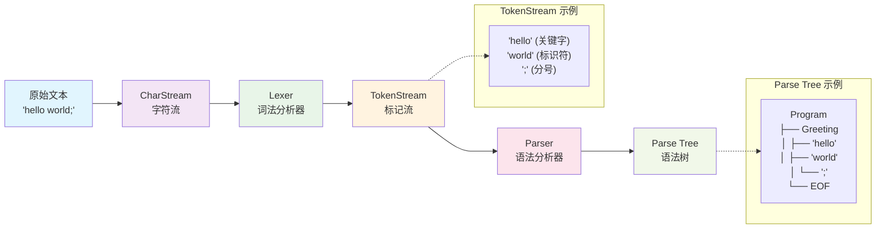

## Hello World 解析器

::: note
示例参考代码: https://github.com/hulo-lang/hulo-dev/tree/main/step-1-hello-world
:::

让我们创建一个简单的 Hello World 解析器来快速体验 ANTLR4。

### 1. 项目结构
```
step-1-hello-world/
├── antlr.jar
├── go.mod
├── go.sum
├── main.go
├── grammar/
│   ├── Hello.g4
│   └── .antlr/
│       ├── Hello.java
│       └── ...
└── generated/
    ├── Hello.interp
    └── ...
```

- **antlr.jar**: ANTLR4工具链
- **main.go**: Go程序入口，演示如何使用生成的解析器解析输入文本
- **go.mod**: Go模块定义文件，声明模块名和依赖关系
- **go.sum**: Go依赖校验文件，确保依赖包的完整性
- **generated/**：包含ANTRL为Go语言生成的所有代码文件
    - hello_lexer.go: 词法分析器，负责将输入文本转换为词法标记
    - hello_parser.go: 语法分析器，负责构建语法树
    - hello_listener.go: 监听器接口，用于遍历语法树
    - hello_base_listener.go: 基础监听器实现
    - Hello.interp: ANTLR4解释器文件
    - Hello.tokens: 标记定义文件
    - HelloLexer.interp: 词法分析器解释器文件
    - HelloLexer.tokens: 词法分析器标记文件
- **grammar/**: 存储语法文件，所有的`.g`或者`.g4`语法声明都存放在这个目录下面
- **grammar/.antlr/**: 包含ANTRL生成的Java代码和编译后的class文件，这些文件用于ANTRL TestRig工具进行语法测试和可视化
    - `.java`文件是ANTRL生成的源代码
    - `.class`文件是编译后的字节码
    - `.tokens`和`.interp`文件是ANTRL的内部文件

看到这里，想必对于初学者而言已经眼花缭乱了吧，哈哈。不是这个概念就是那个概念，其实真正要让你创建的就三个 —— `go.mod` 、 `Hello.g4` 和 `main.go`

首选我们先通过命令的方式初始化项目创建`go.mod`:
```bash
go mod init hulo-dev
```
这个命令的意思是在当前工作目录下初始化名为 `hulo-dev` 的Go语言项目

### 2. 创建语法文件

在初始化项目成功后，我们便可以进入**grammar**目录新建 `Hello.g4` 文件：

::: tip
在 ANTLR4 中，`.g` 和 `.g4` 扩展名均为合法语法文件格式。Hulo 项目源码中主要使用 `.g4`，但在文档中，`.g4` 往往会被误识别为“第 4 行代码块”并触发高亮。为避免混淆，文档示例中统一使用 `.g` 作为展示用的扩展名。
:::

```antlr title="Hello.g"
grammar Hello;

// 语法规则：程序由问候语句组成
program: greeting* EOF;

// 问候语句：hello + 名字
greeting: 'hello' ID ';';

// 词法规则
ID: [a-zA-Z_][a-zA-Z0-9_]*;  // 标识符
WS: [ \t\r\n]+ -> skip;      // 空白字符
```

这个简单的语法定义了如何解析 "hello" 语句：

1. **`grammar Hello;`** - 定义语法名称，这个名称要和文件名相一致。就像Java的类名和文件名对应那样。
2. **`program: greeting* EOF;`** - 程序由零个或多个问候语句组成，以文件结束符结尾
3. **`greeting: 'hello' ID ';';`** - 问候语句由关键字 "hello"、标识符和分号组成
4. **`ID: [a-zA-Z_][a-zA-Z0-9_]*;`** - 标识符以字母或下划线开头，后跟字母、数字或下划线
5. **`WS: [ \t\r\n]+ -> skip;`** - 空白字符（空格、制表符、换行符）被忽略

这些规则现在看不懂没关系，你只要知道它好比正则表达式匹配一样编写。在后面的语法章节，我们会进行详细的介绍。

### 3. 生成解析器

接着让我们回到工作目录执行以下命令：
```bash
java -jar ./antlr.jar -Dlanguage=Go -o ./generated -package generated *.g4
```

### 命令参数解释

这个命令的每个部分都有特定含义：

- **`java -jar ./antlr.jar`** - 使用 Java 运行 ANTLR4 工具
- **`-Dlanguage=Go`** - 指定生成的目标语言为 Go
- **`-o ./generated`** - 指定输出目录为当前目录下的 `generated` 文件夹
- **`-package generated`** - 设置生成的 Go 代码的包名为 `generated`
- **`*.g4`** - 处理当前目录下所有以 `.g4` 结尾的语法文件

### 生成的文件结构

执行成功后，`generated/` 目录下会包含：

```
generated/
├── Hello.interp              # ANTLR4 解释器文件
├── Hello.tokens              # 标记定义文件
├── HelloLexer.interp         # 词法分析器解释器文件
├── HelloLexer.tokens         # 词法分析器标记文件
├── hello_base_listener.go    # 基础监听器实现
├── hello_lexer.go            # 词法分析器
├── hello_listener.go         # 监听器接口
└── hello_parser.go           # 语法分析器
```

至此，Hello语法的分析器生成算是完成了。

### 4. 创建主程序

接着，让我们创建一个主程序来验证下生成的分析器是否可用，首选创建 `main.go` 文件：

```go
package main

import (
	"fmt"
	"hulo-dev/generated"

	"github.com/antlr4-go/antlr/v4"
)

func main() {
	// 输入文本
	input := "hello world;\nhello hulo;"

	// 创建输入流
	inputStream := antlr.NewInputStream(input)

	// 创建词法分析器
	lexer := generated.NewHelloLexer(inputStream)

	// 创建标记流
	tokenStream := antlr.NewCommonTokenStream(lexer, 0)

	// 创建语法分析器
	parser := generated.NewHelloParser(tokenStream)

	// 解析程序
	tree := parser.Program()

	// 创建监听器
	listener := &HelloListener{}

	// 遍历语法树
	antlr.ParseTreeWalkerDefault.Walk(listener, tree)

	fmt.Println("解析完成！")
}

// 自定义监听器
type HelloListener struct {
	*generated.BaseHelloListener
}

// 进入问候语句时调用
func (l *HelloListener) EnterGreeting(ctx *generated.GreetingContext) {
	name := ctx.ID().GetText()
	fmt.Printf("问候: %s\n", name)
}
```

::: tip
目前你不需要知道这些函数代表什么，如何起作用的。只需要先按照demo让他跑起来即可，我们会在后面进行解释的。
:::

### 5. 运行程序

在运行前需要先安装依赖，你可以直接指定版本安装或者直接用`go mod tidy`自动补全依赖，然后才能正常运行：
```bash
# 安装依赖
go get github.com/antlr4-go/antlr/v4@v4.13.1

# 运行程序
go run .
```

**输出结果：**
```bash
问候: world
问候: hulo
解析完成！
```

当终端上打印这些的时候，我们的demo就算是运行成功了。除了从`input`变量读取输入外，antlr的库还支持从其他流输入，例如文件流：

```plain title="test.txt"
hello alice;
hello bob;
hello charlie;
```

假设我们有这样一个文件，它里面存储着“源码”数据，我们可以通过调用`NewFileStream`的方式获取到文件流的输入。

```go
// 从文件读取输入
input := antlr.NewFileStream("test.txt")
// ... 其余代码相同
```


接下来让我们来分析下，我们编写的`main.go`究竟做了什么吧。


语法解析的过程如下图所示：



在上述图例中，我们可以看到：
1. 原始文本解析成 `ChartStream`
2. 经过 `lexer` 将 `ChartStream` 解析为 `TokenStream`
3. 经过 `parser` 将 `TokenStream` 解析为语法树，语法树包含两类节点：`RuleNode`（子树的根节点）和 `TerminalNode`（叶子结点）

### 6. 调试程序

作为一款工业级的项目，antlr也提供了可视化语法树的功能 —— TestRig。使用它也非常的简单，只要执行以下命令就可以进入调试：

```bash
javac -cp ./antlr.jar ./grammar/.antlr/*.java
java -Xmx500M -cp "./antlr.jar;./grammar/.antlr;%CLASSPATH%" org.antlr.v4.gui.TestRig Hello program -gui
```

在上文中，我们介绍了.antlr目录会存储生成的Java代码，其实它本质上和我们生成Go语言的解析器代码无异，只是这个软件它是由Java编写的，所以生成Java代码用于实现类似插件一样的效果可插拔调试。

在第一条命令中，我们会调用`javac`编译.antlr下面所有带`.java`后缀名的文件，编译为`.class`。如果你安装了ANTLR的VSCode插件，它会在你打开`.g4`文件的时候在其所在目录自动生成，否则你就需要自己生成。

在第二条命令中，我们将编译Hello解析器生成的`.class`和`antlr.jar`一并告诉JVM，运行`org.antlr.v4.gui.TestRig`调试工具，并告诉它类的入口为`Hello`，源代码被解析的根节点为`program`。

当运行后，我们的终端就会卡住，这时候我们就可以输入源代码进行调试。例如，输入`hello world;`后按下`Enter`键以及`ctrl+z`便会弹出AST的GUI页面。如果你不想输入或者按错的话，也可以直接按`ctrl+c`强制结束进程。


此外，除了GUI页面，你还可以将`-gui`替换成`-tree`，那么它将会在终端中打印出语法树信息。

```bash
$ ./grun.sh
hello world;
^Z
(program (greeting hello world ;) <EOF>)
```

## 完善解析器

::: note
示例参考代码: https://github.com/hulo-lang/hulo-dev/tree/main/step-2-hello-world-improve
:::

在上文 `Hello.g4` 语法中，`lexer`词法规则和`parser`语法规则都耦合在了一起。尽管在翻译的时候antlr会将他们区分开。但这显然并不是最佳实践。为了更好的组织代码，我们可以将词法规则和语法规则分离到两个文件中：

```antlr title="HelloLexer.g"
lexer grammar HelloLexer;

HELLO: 'hello';
SEMICOLON: ';';

ID: [a-zA-Z_][a-zA-Z0-9_]*; // 标识符
WS: [ \t\r\n]+ -> skip; // 空白字符
```

对于词法规则，任何单独的`token`都必须在`lexer`中声明，否则将会导致`parser`报错（如果你尝试在parser声明词法规则的话）。因此，相比最初版本的`Hello.g`，这个词法规则多出了`HELLO`和`SEMICOLON`的定义。

```antlr title="HelloParser.g"
parser grammar HelloParser;

options {
	tokenVocab = HelloLexer;
}

program: greeting* EOF;

greeting: HELLO ID SEMICOLON;
```

在上述例子中，`HelloLexer`通过`options`的配置导入 `HelloParser`使得词法分析和语法分析各司其职，有更好的维护性、重用性。

## 常见问题

### Q: Can't load Hello as lexer or parser

- 如果出现此问题需要检查如下几项是否正确：

- 确保生成了 `*.java` 文件
- 确保生成了 `*.class` 文件
- 正确设置 `CLASSPATH`, Javac 和 JVM 需要通过这个找到 `*.class`所在的路径加载
